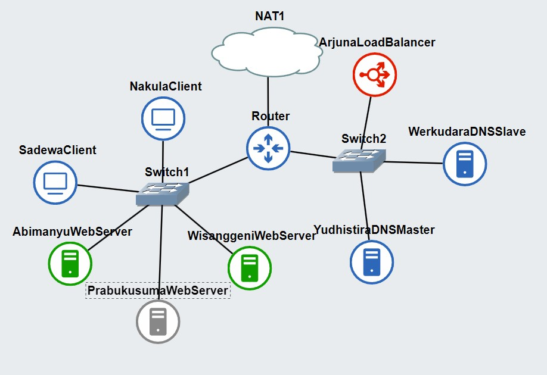

# Jarkom-Modul-2-I04-2023
## **Lapres Praktikum Jarkom Modul 2 Kelompok I-04**
### **I04**
|**Name**|**NRP**|
|--------|-------|
|Muhammad Dzaky Farhan       |5025211069|
|Satria Surya Prana          |5025211073|

## Quesions

1. Yudhistira akan digunakan sebagai DNS Master, Werkudara sebagai DNS Slave, Arjuna merupakan Load Balancer yang terdiri dari beberapa Web Server yaitu Prabakusuma, Abimanyu, dan Wisanggeni. Buatlah topologi dengan pembagian sebagai berikut. Folder topologi dapat diakses pada drive berikut
2. Buatlah website utama pada node arjuna dengan akses ke **arjuna.yyy.com** dengan alias **www.arjuna.yyy.com** dengan yyy merupakan kode kelompok.
3. Dengan cara yang sama seperti soal nomor 2, buatlah website utama dengan akses ke **abimanyu.yyy.com** dan alias **www.abimanyu.yyy.com**.
4. Kemudian, karena terdapat beberapa web yang harus di-deploy, buatlah subdomain **parikesit.abimanyu.yyy.com** yang diatur DNS-nya di Yudhistira dan mengarah ke Abimanyu.
5. Buat juga reverse domain untuk domain utama. (_Abimanyu saja yang direverse_)
6. Agar dapat tetap dihubungi ketika DNS Server Yudhistira bermasalah, buat juga Werkudara sebagai DNS Slave untuk domain utama.
7. Seperti yang kita tahu karena banyak sekali informasi yang harus diterima, buatlah subdomain khusus untuk perang yaitu **baratayuda.abimanyu.yyy.com** dengan alias **www.baratayuda.abimanyu.yyy.com** yang didelegasikan dari Yudhistira ke Werkudara dengan IP menuju ke Abimanyu dalam folder Baratayuda.
8. Untuk informasi yang lebih spesifik mengenai Ranjapan Baratayuda, buatlah subdomain melalui Werkudara dengan akses **rjp.baratayuda.abimanyu.yyy.com** dengan alias **www.rjp.baratayuda.abimanyu.yyy.com** yang mengarah ke Abimanyu.
9. Arjuna merupakan suatu Load Balancer Nginx dengan tiga worker (yang juga menggunakan nginx sebagai webserver) yaitu Prabakusuma, Abimanyu, dan Wisanggeni. Lakukan deployment pada masing-masing worker.
10. Kemudian gunakan algoritma **Round Robin** untuk Load Balancer pada **Arjuna**. Gunakan _server_name_ pada soal nomor 1. Untuk melakukan pengecekan akses alamat web tersebut kemudian pastikan worker yang digunakan untuk menangani permintaan akan berganti ganti secara acak. Untuk webserver di masing-masing worker wajib berjalan di port 8001-8003. Contoh
    - _Prabakusuma:8001_
    - _Abimanyu:8002_
    - _Wisanggeni:8003_
11. Selain menggunakan Nginx, lakukan konfigurasi Apache Web Server pada worker Abimanyu dengan web server **www.abimanyu.yyy.com**. Pertama dibutuhkan web server dengan DocumentRoot pada /var/www/abimanyu.yyy
12. Setelah itu ubahlah agar url **www.abimanyu.yyy.com/index.php/home** menjadi **www.abimanyu.yyy.com/home**.
13. Selain itu, pada subdomain **www.parikesit.abimanyu.yyy.com**, DocumentRoot disimpan pada /var/www/parikesit.abimanyu.yyy
14. Pada subdomain tersebut folder /public hanya dapat melakukan _directory listing_ sedangkan pada folder /secret tidak dapat diakses (_403 Forbidden_).
15. Buatlah kustomisasi halaman error pada folder /error untuk mengganti error kode pada Apache. Error kode yang perlu diganti adalah 404 Not Found dan 403 Forbidden.
16. Buatlah suatu konfigurasi virtual host agar file asset **www.parikesit.abimanyu.yyy.com/public/js** menjadi **www.parikesit.abimanyu.yyy.com/js**
17. Agar aman, buatlah konfigurasi agar **www.rjp.baratayuda.abimanyu.yyy.com** hanya dapat diakses melalui port 14000 dan 14400.
18. Untuk mengaksesnya buatlah autentikasi username berupa “Wayang” dan password “baratayudayyy” dengan yyy merupakan kode kelompok. Letakkan DocumentRoot pada /var/www/rjp.baratayuda.abimanyu.yyy.
19. Buatlah agar setiap kali mengakses IP dari Abimanyu akan secara otomatis dialihkan ke **www.abimanyu.yyy.com (alias)**
20. Karena website **www.parikesit.abimanyu.yyy.com** semakin banyak pengunjung dan banyak gambar gambar random, maka ubahlah request gambar yang memiliki substring “abimanyu” akan diarahkan menuju abimanyu.png.

PS:

- **yyy** pada url adalah **kode kelompok anda**
- File requirement dapat diakses melalui drive berikut.

The topology is created according to the given requirements, where `NAT1` is connected to the `Router`, which is then connected to two switches, each of which is connected to several nodes. `Switch1` is connected to `NakulaClient`, `SadewaClient`, `AbimanyuWebServer`, `PrabakusumaWebServer`, and `WisanggeniWebServer`. Meanwhile, `Switch2` is connected to `YudhistiraDNSMaster`, `WerkudaraDNSSlave`, and `ArjunaLoadBalancer`.

> _Answer No 1_



These are the IP addresses for each node in the above topology.

```sh
NakulaClient = 192.230.1.2 
SadewaClient = 192.230.1.3
AbimanyuWebServer = 192.230.1.4
PrabukusumaWebServer = 192.230.1.5
WisanggeniWebServer = 192.230.1.6

YudhistiraDNSMaster = 192.230.2.2
WerkudaraDNSSlave = 192.230.2.3
ArjunaLoadBalancer = 192.230.2.4
```

## DNS-Setup

DNS will be set up on YudhistiraDNSMaster and WerkudaraDNSSlave. The requirements from the question are as follows:

- Create the main website on the Arjuna node with access to arjuna.yyy.com with the alias www.arjuna.yyy.com, where yyy   represents the group code <span style="color:orange; font-weight:bold;">(question 2)</span>.
- Create the main website with access to abimanyu.yyy.com and alias www.abimanyu.yyy.com <span style="color:orange; font-weight:bold;">(question 3)</span>.
- Create a subdomain parikesit.abimanyu.yyy.com with its DNS configured on Yudhistira and directed to Abimanyu <span style="color:orange; font-weight:bold;">(question 4)</span>.
- Also, create a reverse domain for the main domain <span style="color:orange; font-weight:bold;">(question 5)</span>.
- Set up Werkudara as a DNS Slave for the main domain <span style="color:orange; font-weight:bold;">(question 6)</span>.
- Create a specific subdomain for the war, namely baratayuda.abimanyu.yyy.com with the alias www.baratayuda.abimanyu.yyy.com, delegated from Yudhistira to Werkudara with an IP pointing to Abimanyu in the Baratayuda folder <span style="color:orange; font-weight:bold;">(question 7)</span>.
- Create a subdomain through Werkudara with access to rjp.baratayuda.abimanyu.yyy.com with the alias www.rjp.baratayuda.abimanyu.yyy.com, which directs to Abimanyu <span style="color:orange; font-weight:bold;">(question 8)</span>.

### Setting DNS Master

> _named.conf.local_ Yudhistira


```bind
//
// Do any local configuration here
//

// Consider adding the 1918 zones here, if they are not used in your
// organization
//include "/etc/bind/zones.rfc1918";

// main arjuna
zone "arjuna.i04.com" {
        type master;
        notify yes;
        also-notify { 192.230.2.3; };  
        allow-transfer { 192.230.2.3; };  
        file "/etc/bind/arjuna/arjuna.i04.com";
};

// main abimanyu
zone "abimanyu.i04.com" {
        type master;
        notify yes;
        also-notify { 192.230.2.3; };  
        allow-transfer { 192.230.2.3; };  
        file "/etc/bind/abimanyu/abimanyu.i04.com";
};

zone "baratayuda.abimanyu.i04.com" {
    type master;
    file "/etc/bind/delegasi/baratayuda.abimanyu.i04.com";
    allow-transfer { 192.230.2.3; };  
};

// reverse abimanyu
zone "1.230.192.in-addr.arpa" {
    type master;
    notify yes;
    also-notify { 192.230.2.3; };  
    allow-transfer { 192.230.2.3; };  
    file "/etc/bind/abimanyu/1.230.192.in-addr.arpa";
};
```
There is a BIND DNS server configuration file named `named.conf.local`, where several DNS zones have been set up, including:

1. `arjuna.i04.com`: A DNS zone for the domain **arjuna.i04.com**, configured as the master server, and it notifies the slave server (Werkudara) of any updates.
2. `abimanyu.i04.com`: A DNS zone for the domain **abimanyu.i04.com**, also set as the master server, and it notifies the slave server (Werkudara) of any changes.
3. `baratayuda.abimanyu.i04.com`: A DNS zone for the subdomain **baratayuda.abimanyu.i04.com**, configured as the master server, and the zone data for this subdomain is stored in a file.
   - <span style="color:gray; font-style:italic;"> Note: This zone is a workaround solution, as without this zone declaration, the subdomain baratayuda would not be recognized as delegated to Werkudara. (not a best practice)</span>
4. `1.230.192.in-addr.arpa`: A reverse DNS zone for the IP address range 192.230.1.0/24 used by the domain abimanyu.i04.com, also set as the master server, and it notifies the slave server (Werkudara) of any changes.

After that, the BIND zone files for each zone are as follows.

 _Arjuna Zone_


```bind
;
; BIND data file for local loopback interface
;
$TTL    604800
@       IN      SOA     arjuna.i04.com. root.arjuna.i04.com. (
                              2         ; Serial
                         604800         ; Refresh
                          86400         ; Retry
                        2419200         ; Expire
                         604800 )       ; Negative Cache TTL
;
@       IN      NS      arjuna.i04.com.
@       IN      A       192.230.2.4       ; IP Arjuna
www     IN      CNAME   arjuna.i04.com.
@       IN      AAAA    ::1
```

In the first line, the **NS (Name Server)** indicates that the authoritative server for this zone is `arjuna.i04.com`. Then, the **A (Address)** record associates the name **@ (root domain)** with the IP address `192.230.2.4`, possibly referring to this DNS server. Additionally, there is a **CNAME** record linking `www to arjuna.i04.com`, so when accessing `www.arjuna.i04.com`, it redirects to `arjuna.i04.com`.

> _Abimanyu Zone_


```bind
;
; BIND data file for local loopback interface
;
$TTL    604800
@       IN      SOA     abimanyu.i04.com. root.abimanyu.i04.com. (
                              2         ; Serial
                         604800         ; Refresh
                          86400         ; Retry
                        2419200         ; Expire
                         604800 )       ; Negative Cache TTL
;
@       IN      NS      abimanyu.i04.com.
@       IN      A       192.230.1.4       ; IP Abimanyu
www     IN      CNAME   abimanyu.i04.com.
parikesit       IN      A       192.230.1.4       ; IP Abimanyu
www.parikesit   IN      CNAME   parikesit.abimanyu.i04.com.
ns1     IN      A       192.230.2.3       ; IP Werkudara
baratayuda      IN      NS      ns1
@       IN      AAAA    ::1
```
The **NS (Name Server)** declaration indicates that the authoritative server for this zone is `abimanyu.i04.com`. The **A (Address)** record associates the name **@ (root domain)** with the IP address **192.230.1.4**, which likely refers to this DNS server. Additionally, there is a **CNAME** record linking `www to abimanyu.i04.com`, so when accessing `www.abimanyu.i04.com`, it redirects to `abimanyu.i04.com`.

There is also another **A** record for the **parikesit subdomain**, which points to the same IP address as `abimanyu.i04.com`. Furthermore, the **CNAME** record for `www.parikesit` associates this subdomain with `parikesit.abimanyu.i04.com`.

Next, there is a subdomain delegation for `baratayuda.abimanyu.i04.com` with NS records directing it to the server `ns1 (Werkudara)`. This allows the subdomain `baratayuda` to be managed by a different DNS server, in this case, the server ns1.

There is also an AAAA record associating the name **@** with the IPv6 loopback address `::1`.

> _Reverse Abimanyu Zone_


```bind
;
; BIND data file for local loopback interface
;
$TTL    604800
@       IN      SOA     abimanyu.i04.com. root.abimanyu.i04.com. (
                              2         ; Serial
                         604800         ; Refresh
                          86400         ; Retry
                        2419200         ; Expire
                         604800 )       ; Negative Cache TTL
;
1.230.192.in-addr.arpa.   IN      NS      abimanyu.i04.com.
4                       IN      PTR     abimanyu.i04.com. ; Byte ke-4 Abimanyu
```

The **NS (Name Server)** declaration links this reverse zone to the server `abimanyu.i04.com`. Furthermore, there is a **PTR (Pointer)** record associating the IP address `192.230.1.4` with the domain name `abimanyu.i04.com`.

To make the subdomain delegation for `baratayuda.abimanyu.i04.com` work, we need to make a few changes to the `named.conf.options` file.


```bind
options {
        directory "/var/cache/bind";

        // If there is a firewall between you and nameservers you want
        // to talk to, you may need to fix the firewall to allow multiple
        // ports to talk.  See http://www.kb.cert.org/vuls/id/800113

        // If your ISP provided one or more IP addresses for stable
        // nameservers, you probably want to use them as forwarders.
        // Uncomment the following block, and insert the addresses replacing
        // the all-0's placeholder.

        forwarders {
               192.168.122.1; // IP ns Router
        };

        //========================================================================
        // If BIND logs error messages about the root key being expired,
        // you will need to update your keys.  See https://www.isc.org/bind-keys
        //========================================================================
        //dnssec-validation auto;
        allow-query{any;};

        auth-nxdomain no;    # conform to RFC1035
        listen-on-v6 { any; };
};
```

Adding `allow-query { any; };` allows the DNS server to receive various types of DNS requests, including those related to subdomain delegation, which enables the flow of delegation information. Additionally, IP forwarding to the router is applied so that clients can access the internet with just the Master nameserver.

### Setting DNS Slave

> _named.conf.local_ Werkudara


```bind
//
// Do any local configuration here
//

// Consider adding the 1918 zones here, if they are not used in your
// organization
//include "/etc/bind/zones.rfc1918";

zone "arjuna.i04.com" {
    type slave;
    masters { 192.230.2.2; }; // IP Yudhistira sebagai Master
    file "var/lib/bind/arjuna/arjuna.i04.com";
};

zone "abimanyu.i04.com" {
    type slave;
    masters { 192.230.2.2; }; // IP Yudhistira sebagai Master
    file "var/lib/bind/abimanyu/abimanyu.i04.com";
};

zone "1.230.192.in-addr.arpa" {
    type slave;
    masters { 192.230.2.2; };  // IP Yudhistira sebagai Master
    file "/etc/lib/bind/abimanyu/1.230.192.in-addr.arpa";
};

zone "baratayuda.abimanyu.i04.com" {
    type master;
    file "/etc/bind/delegasi/baratayuda.abimanyu.i04.com";
};
```

In this configuration, there are several zones in the DNS server:

- Zones `"arjuna.i04.com"` and `"abimanyu.i04.com"` are specified as **slave zones** that follow the master server (Yudhistira) with the aim of storing a copy of the master zone data.
- Zone `"1.230.192.in-addr.arpa"` is also a **slave zone** that follows the master server for **reverse DNS resolution**.
- Zone `"baratayuda.abimanyu.i04.com"` is specified as a master zone, which means this DNS server is authoritative for this zone and responsible for the delegation of the subdomain `"baratayuda.abimanyu.i04.com"`.

Following that, the BIND zone file for the delegation zone `baratayuda` is as follows:

> _Delegation Baratayuda Zone_


```bind
;
; BIND data file for local loopback interface
;
$TTL    604800
@       IN      SOA     baratayuda.abimanyu.i04.com. root.baratayuda.abimanyu.i04.com. (
                              2         ; Serial
                         604800         ; Refresh
                          86400         ; Retry
                        2419200         ; Expire
                         604800 )       ; Negative Cache TTL
;
@       IN      NS      baratayuda.abimanyu.i04.com.
@       IN      A       192.230.1.4       ; IP Abimanyu (baratayuda)
www     IN      CNAME   @               ; IP Abimanyu (baratayuda)
rjp     IN      A       192.230.1.4       ; IP Abimanyu (rjp baratayuda)
www.rjp IN      CNAME   rjp.baratayuda.abimanyu.i04.com. ; IP Abimanyu (rjp baratayuda)
```

The **NS (Name Server)** declaration links this zone to the authoritative server, `baratayuda.abimanyu.i04.com.`, which points to the IP address `192.230.1.4`. Next, the **A** record associates the IP address `192.230.1.4` with the domain name `baratayuda.abimanyu.i04.com`. Then, there is a **CNAME** record creating an alias `www` to refer to the `baratayuda.abimanyu.i04.com` zone, and `rjp`, which points to the IP address `192.230.1.4`. Lastly, another **CNAME** record links the alias `www.rjp` to the subdomain `rjp.baratayuda.abimanyu.i04.com` in the `baratayuda.abimanyu.i04.com` zone.

To make the subdomain delegation for `baratayuda.abimanyu.i04.com` work, some settings need to be changed in the `named.conf.options` file.

```bind
options {
        directory "/var/cache/bind";

        // If there is a firewall between you and nameservers you want
        // to talk to, you may need to fix the firewall to allow multiple
        // ports to talk.  See http://www.kb.cert.org/vuls/id/800113

        // If your ISP provided one or more IP addresses for stable
        // nameservers, you probably want to use them as forwarders.
        // Uncomment the following block, and insert the addresses replacing
        // the all-0's placeholder.

        // forwarders {
        //      0.0.0.0;
        // };

        //========================================================================
        // If BIND logs error messages about the root key being expired,
        // you will need to update your keys.  See https://www.isc.org/bind-keys
        //========================================================================
        //dnssec-validation auto;
        allow-query{any;};

        auth-nxdomain no;    # conform to RFC1035
        listen-on-v6 { any; };
};
```
The settings in this file are the same as the master configuration, except that there is no IP forwarding to the router for the internet here.

To ensure that all of this runs automatically when the node is powered on, and the progress is not lost, the following steps are taken:

- Copy the `bind` folder to the root directory with the command `cp -rf /etc/bind /root/dns`.
- Create a script to install dependencies and the necessary commands for `bind9`.

```sh
apt-get update
apt-get install bind9 -y
cp -r -f /root/dns/bind /etc/
service bind9 restart
```

- Call the script Through **/root/.bashrc**

These are the results of testing from NakulaClient

## Setup-WebServer

Web servers will be set up on ArjunaLoadBalancer, AbimanyuWebServer, PrabakusumaWebServer, and WisanggeniWebServer. The requirements from the question are as follows:

- Arjuna is an Nginx Load Balancer with three workers (also using Nginx as the web server), namely Prabakusuma, Abimanyu, and Wisanggeni. <span style="color:orange; font-weight:bold;">(question 9)</span>
- Use the Round Robin algorithm for the Load Balancer on Arjuna. Use the server names as provided in question 1. For web servers on each worker, they must run on ports 8001-8003. For example: <span style="color:orange; font-weight:bold;">(question 10)</span>
  - _Prabakusuma:8001_
  - _Abimanyu:8002_
  - _Wisanggeni:8003_
